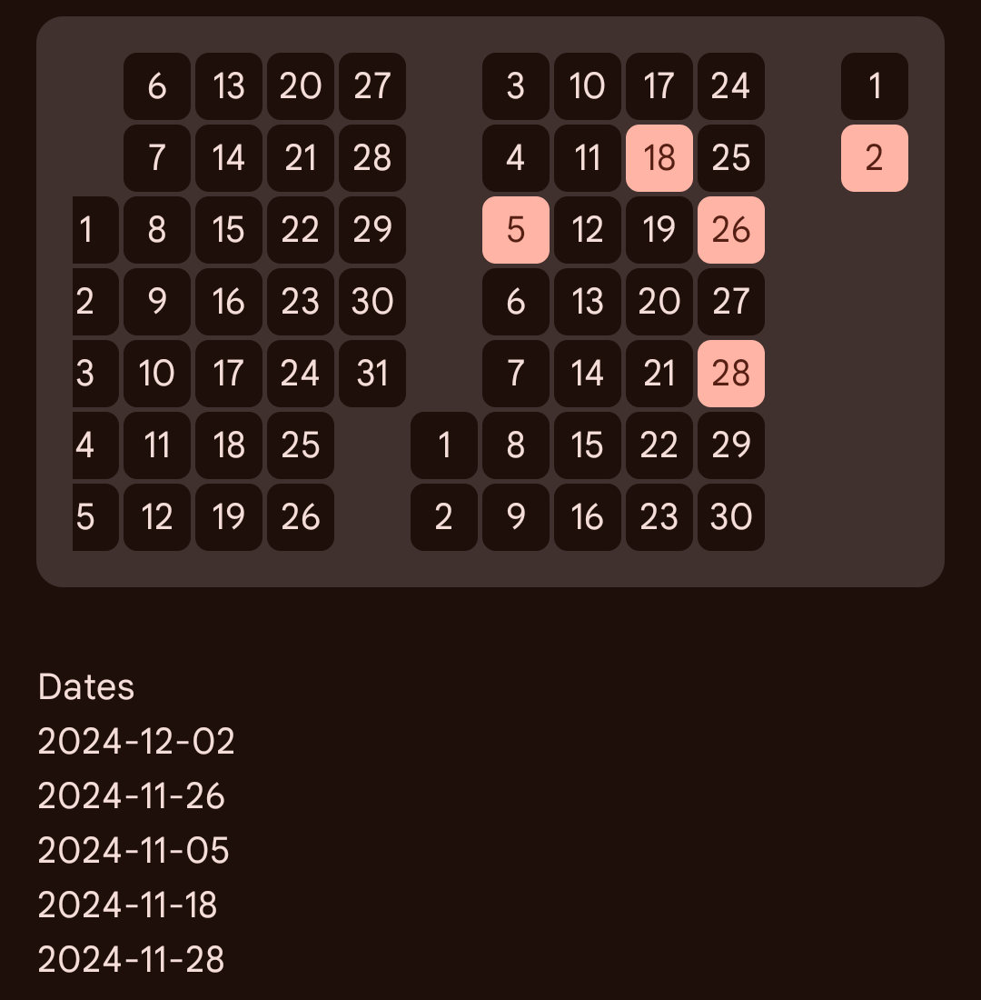

# Heat Maps
### Heat Maps Library for Jetpack Compose

[](https://jitpack.io/#shub39/HeatMaps)

|                                            Type                                            |                    Screenshot                     |
|:------------------------------------------------------------------------------------------:|:-------------------------------------------------:|
| [Boolean Heat Map](https://github.com/shub39/HeatMaps?tab=readme-ov-file#boolean-heat-map) |  |

## Use

```kotlin
dependencies {
    val heatmaps = "1.0.0" // replace with latest version
    
    implementation("com.github.shub39:HeatMaps:$heatmaps")
}
```

### Boolean Heat Map

```kotlin
var data by remember { mutableStateOf(listOf<LocalDate>(LocalDate.now())) }

Card {
    BooleanHeatMap(
        dates = data, // set of data
        modifier = Modifier
            .padding(16.dp)
            .fillMaxWidth(),
        editEnabled = true, // onClick enabled or not
        onClick = { localDate ->
            if (data.contains(localDate)) {
                data -= localDate
            } else {
                data += localDate
            }
        }
    )
}
```